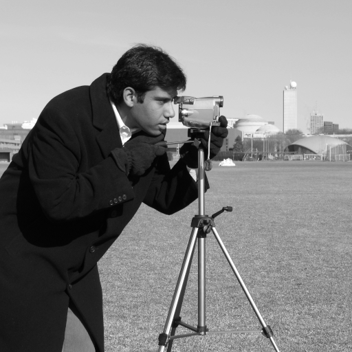

# blurtool 

This package provides a quick way to perform nonstationary blur operations using PyTorch, including tools for creating, manipulating, and storing Point Spread Function (PSF) objects. It also includes an implementation of the Eigenkernels approach proposed by [Gwak & Yang (2020)](https://doi.org/10.1364/OE.405448) as well as a robust alternative as described in [Brandão-Junior (2023)](https://doi.org/10.14209/sbrt.2023.1570908350).

| Original | Stationary Blur | Nonstationary Blur |
|---------------------|---------------------------|-------------------------------|
|  |  |  |

## Basic Usage Examples

Import some libraries and load a test image with the following code
```python
import blurtool
import torch
from skimage import data

# Load camera man image
image = data.camera()
image = torch.from_numpy(image).float()/255.0
```

We will now describe some ways of operating on that image. A complete example is in [examples/demo.py](examples/demo.py)  

### 1. Stationary blur 
```python
# Create Blur operators
gauss_kernel = blurtool.Kernel((25,25), 'gaussian', {'sx':0.25, 'sy':0.05, 'angle':45})
blur = blurtool.StationaryBlur(gauss_kernel)

# Apply the stationary blur 
blurred_image = blur(image)
```

### 2. Nonstationary blur (Direct convolution, _slow_)
```python
# Create a nonstationary lattice of kernels based on a rotated Gaussian model.
# Notice that this lattice has the same shape as the test image, that is, for each 
# point in the original image, we have a corresponding stationary kernel in the Lattice.
lat = blurtool.RotGaussian(
    shape=image.shape,
    kernel_shape=(25,25),
    lattice_pars={'ax':0.01, 'ay':0.01, 'bx':0.5, 'by':0.1, 'gamma_x':1, 'gamma_y':1})

# Create a nonstationary blur from the lattice
blur = blurtool.StationaryBlur(lat)

# Apply the nonstationary blur
blurred_image = blur(image)
```

### 3. Nonstationary blur (Using eigen PSF model) 
```python
# Since the original lattice from the previous example is too big and redundant, 
# we can sample it in only (8,8) stationary kernels in a zero order regular fashion.
sampled_lat = lat.sample(sampled_shape = (8,8))


# Compute the eigen PSF lattice of the sampled Lattice.
pca_lat = blurtool.DecomposeLattice(sampled_lat, 
                                    image.shape,
                                    mode = 'pca',
                                    decompose_pars = {'r':15})

# Create a nonstationary blur object from the eigen PSF lattice
blur = blurtool.NonstationaryBlur(pca_lat)

# Apply the nonstationary blur
blurred_image = blur(image)
```

## Installation

For a clean setup, we recommend using a virtual environment. For instance, using micromamba 

```bash
micromamba create -n blurtool python=3.10
micromamba activate blurtool
```

Clone the repository and install it 
```bash
git clone https://github.com/yourusername/blurtool.git
cd blurtool
pip install .
```

Alternatively, install the dependencies only
```bash
pip install -r requirements.txt
```


## Citation

If you wish to cite this work, you can use the following `bibtex` entry

```bibtex
@inproceedings{brandao2023nonstationary,
    title = {Nonstationary blur modeling using robust eigenkernels},
    author = {Brandão-Junior, M. L.},
    booktitle = {XLI Brazilian Symposium On Telecommunications and Signal Processing},
    year = {2023},
    publisher = {Brazilian Telecommunications Society},
    note = {Symposium paper},
    doi = {10.14209/sbrt.2023.1570908350},
    url = {https://doi.org/10.14209/sbrt.2023.1570908350},
}
```
